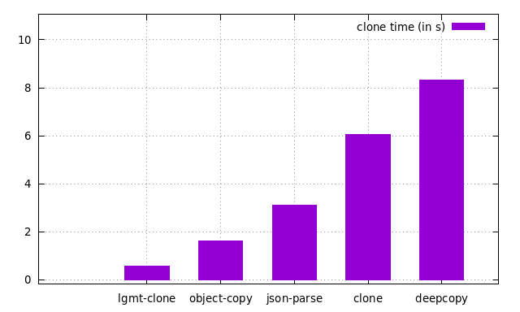

In this test we compared the following object clone lib speeds:

- @logicamente.info/clone (https://github.com/logicamenteinfo/clone)
- clone (https://github.com/pvorb/clone)
- deepcopy (https://github.com/sasaplus1/deepcopy.js)
- object-copy (https://github.com/jonschlinkert/object-copy)
- native JSON.parse(JSON.stringify)

You can see it running [in this video](https://www.youtube.com/watch?v=i6jzrs7dI6o).

## Test rules

1. A common object to be cloned on every lib

```js
{
  literal: 1,
  array: [1],
  objects: [{ literal: 1 }, { literal: 1 }],
  child: {
    literal: 1,
    array: [1],
    objects: [{ literal: 1 }, { literal: 1 }],
  },
}
// This object uses 206 bytes in order to be instanced
```
3. Run the full test a few times (set to 10 tests)

2. Run a large number of iterations for each full test (set to 1.000.000 iterations/test)

4. Register the time taken in every full test, then calculate the average

As the object will be cloned to another location in memory, it will generates an I/O throughput of 196.46 MB for each full test (206 B x 10^6), that results in 1.92 GB per lib (206 B x 10^7).

The average time to run this scenario is plotted below:

